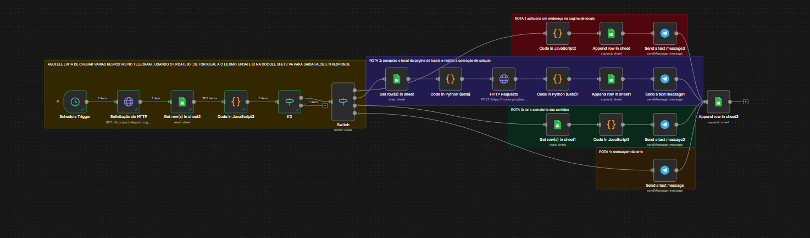

# 🏍️ Motoboy Prime - Automação Logística de Entregas com n8n

O **Motoboy Prime** é uma solução de automação logística desenvolvida no n8n para otimizar o processo de cotação, cálculo de rotas e registro financeiro de entregas urbanas. A partir de comandos simples no Telegram, o sistema processa endereços, calcula a melhor rota via API e registra as informações automaticamente no Google Sheets.

---

## 🛠️ Tecnologias & Ferramentas
* **n8n (Self-Hosted/Local):** Orquestração e automação de todo o fluxo de dados.
* **Telegram Bot API:** Interface principal para envio e recebimento de requisições.
* **Google Routes API:** Geolocalização, cálculo preciso de distâncias (metros) e tempos de percurso.
* **Python:** Lógica de negócio para otimização e seleção automática da menor rota encontrada.
* **JavaScript:** Truncamento, formatação de dados e adequação para moeda local (BRL).
* **Google Sheets:** Banco de dados relacional leve para registro de histórico e controle de caixa.

---

## 📌 Funcionalidades Principais
* 🤖 **Atendimento Via Bot:** Interface no Telegram rápida para entrada de endereços de origem e destino.
* ⚡ **Algoritmo Otimizador em Python:** Filtra automaticamente a rota de menor quilometragem entre as opções retornadas pela API.
* 💰 **Precificação Automática:** Aplica taxa por km rodado e formata o valor no padrão de moeda brasileiro (`R$ X,XX`).
* 📊 **Persistência de Dados:** Gravação automática da data, distância em KM e valor calculado em planilha do Google Sheets.
* 🛡️ **Segurança de Credenciais:** Separação total da lógica do fluxo em relação às chaves e tokens de acesso.

---

## 🏗️ Arquitetura do Fluxo

                                                
